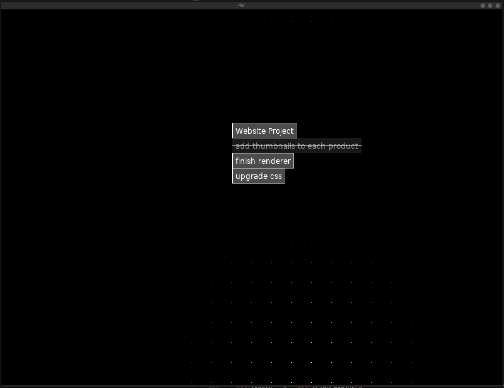

## Plan

A simple program to help you stay organised.
Requires Love2d 11.1.

Press 'n' anywhere to make a new task.
Press 'n' on an existing task to add a new task to the end of the chain.
Press 'x' or 'delete' on a task to delete it.
Double click on a task to start editing it.
Middle click on a task to mark it as done (strikethrough)
Pan the view with left click (not clicking on any tasks) or using middle click.
'Return' or clicking off of a task will stop editing it.

